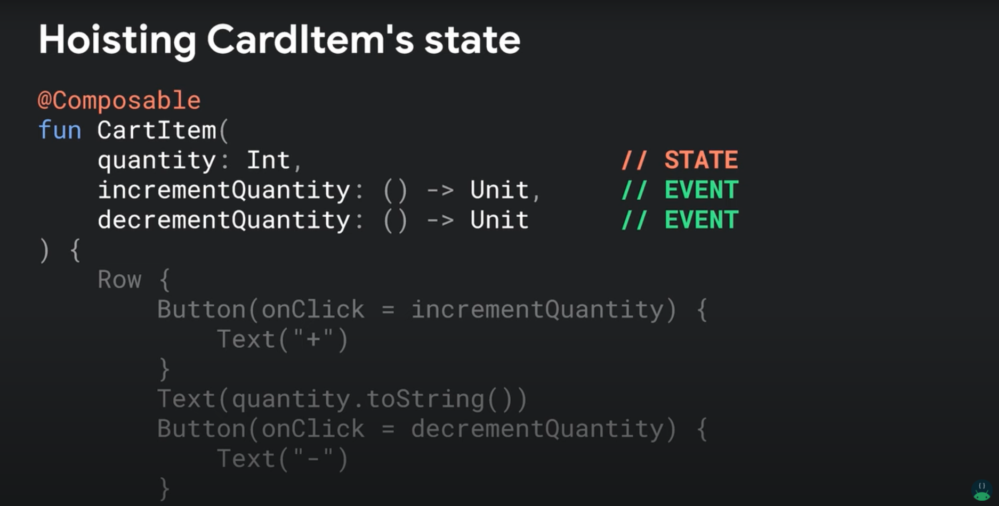
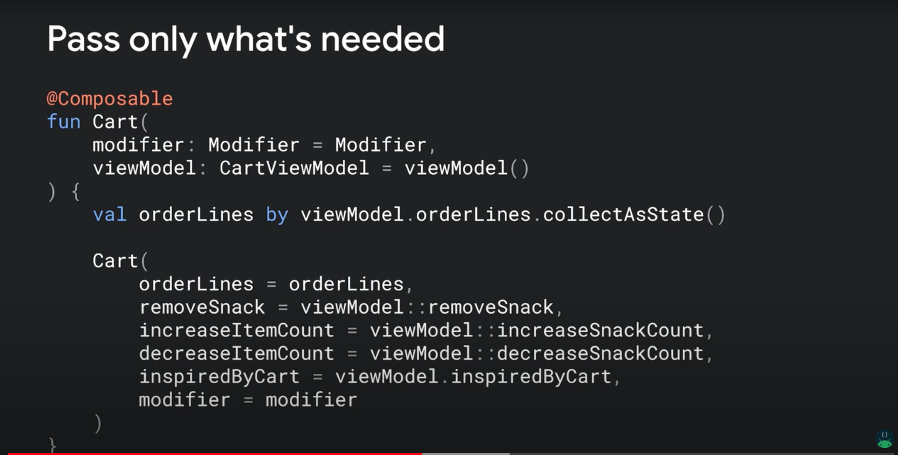
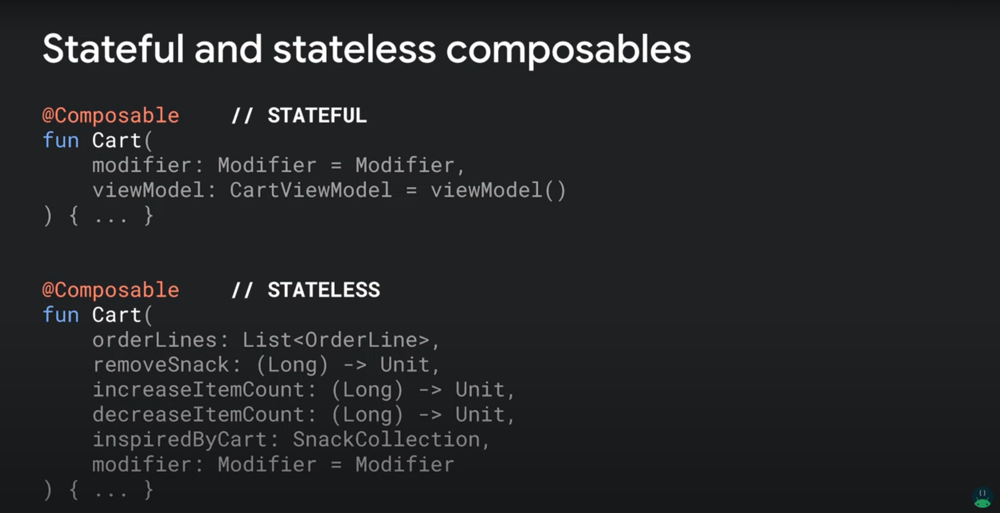
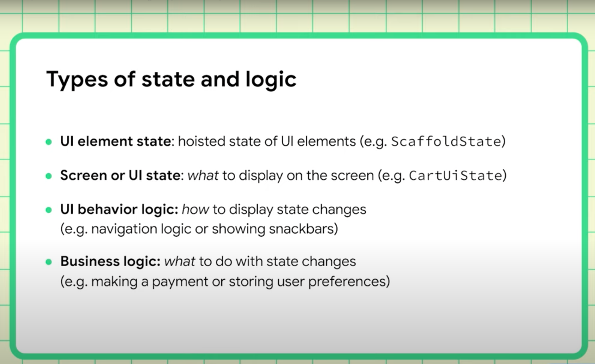
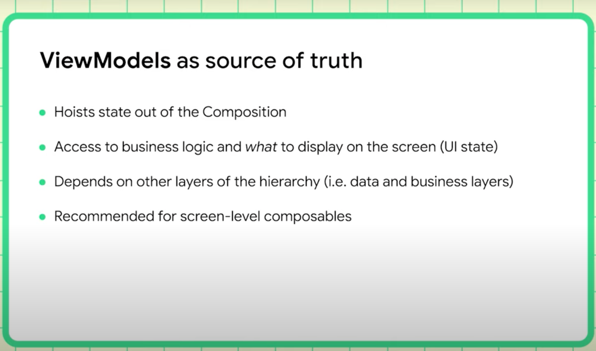
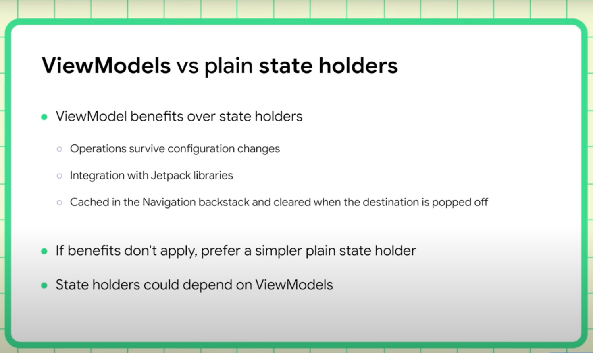
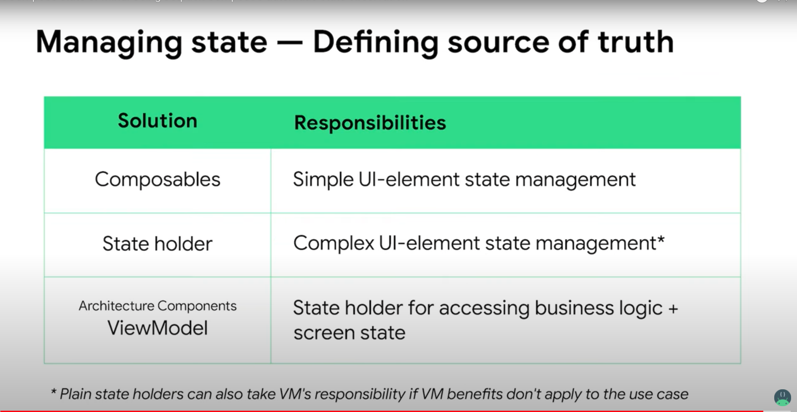

 ## Jetpack Compose Tutorials:
* (https://www.youtube.com/watch?v=qvDo0SKR8-k&t=271s)
* (https://www.youtube.com/watch?v=mymWGMy9pYI)
* (https://www.youtube.com/watch?v=rmv2ug-wW4U)  
* (https://developer.android.com/jetpack/compose/state)
* (https://developer.android.com/courses/pathways/compose)
* (https://developer.android.com/codelabs/jetpack-compose-state#0)

## Compose State:
* Persist state across re-composition: `remember`
* Persist state across configuration changes: `rememberSaveable`
* State created in composables needs to be remembered.
* Hoist state to at least the lowest common ancestor of its consumers.

* _Hoist the state_ for re-usability and testabilit y
* Use ViewModel with LiveData and `observeAsState`

#Key Concepts:
* Single Source of Truth Principle
* State Hoisting (State down, Events up)  - re-usable, testable, loose couple
* Stateless Composables (more re-usable) vs Stateful Composables

## Compose Side Effect:

